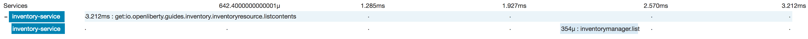

// Copyright (c) 2017 IBM Corporation and others.
// Licensed under Creative Commons Attribution-NoDerivatives
// 4.0 International (CC BY-ND 4.0)
//   https://creativecommons.org/licenses/by-nd/4.0/
//
// Contributors:
//   IBM Corporation
:projectid: microprofile-opentracing
:page-layout: guide
:page-duration: 15 minutes
// :page-releasedate: 2017-12-11
:page-description: Learn how to enable and customize tracing of JAX-RS and non JAX-RS methods using MP OpenTracing.
:page-tags: ['MicroProfile', 'OpenTracing']
:page-permalink: /guides/{projectid}
:page-related-guides: ['cdi-intro']
:common-includes: https://raw.githubusercontent.com/OpenLiberty/guides-common/master
:source-highlighter: prettify
= Enabling distributed tracing in MicroProfile applications

Learn how to enable and customize tracing of JAX-RS and non JAX-RS methods using MP OpenTracing.

== What you'll learn

You will learn how to enable automatic tracing for JAX-RS methods as well as create custom tracers
for non JAX-RS methods using MP OpenTracing.

OpenTracing is a standard API for instrumenting microservices for distributed tracing. Distributed
tracing helps troubleshoot microservices by examining and logging requests as they propagate through a
distributed system, allowing developers to tackle otherwise difficult task of debugging these requests.
Without a distributed tracing system in place, it becomes extremely difficult to analyze the workflows of
operations, in particular, being able to pinpoint when and by whom a request is received, as well as
when a response is sent back.

MicroProfile OpenTracing aims to enable distributed tracing in MicroProfile applications without having
to add any explicit distributed tracing code to the application.

Note, that the MP OpenTracing specification does not address the problem of defining, implementing, or
configuring the underlying distributed tracing system. Rather, it makes it easy to instrument services
with distributed tracing given an existing distributed tracing system.

You will configure the provided `inventory` and `system` services to make use of distributed tracing
using MP OpenTracing.

The complete MicroProfile OpenTracing specification is available https://github.com/eclipse/microprofile-opentracing/blob/master/spec/src/main/asciidoc/microprofile-opentracing.asciidoc[here].


// =================================================================================================
// Getting Started
// =================================================================================================

include::{common-includes}/gitclone.adoc[]

Next, follow https://zipkin.io/pages/quickstart.html[these] quickstart instructions for setting up
and running Zipkin. Zipkin is a popular, distributed tracing system that is free to use. You are not
restricted to using Zipkin, but keep in mind that this guide was written from the Zipkin perspective
and you may need additional instructions not listed here if you choose to use another tracing system.

Make sure your Zipkin server is up and running before you proceed. For us, Zipkin can be accessed at http://localhost:9411

=== Try what you'll build

The `finish` directory in the root directory of this guide contains two services that have been configured
to use MP OpenTracing. Feel free to give them a try before you proceed.

To try out the services, first navigate to the `finish` directory and then execute the following
Maven goals to build the services and run them in two instances of Open Liberty:

```
mvn install liberty:start-server
```

Point your browser to {inv-url}. This is the staring point of the `inventory`
service and it displays the current contents of the inventory. When you visit this endpoint, you make a
GET HTTP request to the service. This GET request is configured to be traced, and therefore a new trace entry
of one span long will appear in your Zipkin server. Navigate to your Zipkin server to verify this. Next, point to {inv-url}/localhost.
This will make two GET requests: one to the `inventory` service and one to the `system` service. Both
of these requests are configured to be traced. Visit your Zipkin server to verify that a new trace of
two spans long has been logged. There are no other methods/requests left to trace, so feel free to repeat
this process as many times as you want to see more traces being recorded. You can also inspect each trace
for more detailed information such as the time at which the request was received and the time at which a
response was sent back.

Once you are done checking out the services, stop both Open Liberty servers:

```
mvn liberty:stop-server
```

Now, navigate back to the `start` directory to begin.


// =================================================================================================
// Building the application
// =================================================================================================

include::{common-includes}/mvnbuild.adoc[]

You can find the `inventory` and `system` services at:

:inv-url: http://localhost:9081/inventory/systems
:sys-url: http://localhost:9080/system/properties

- {inv-url}
- {sys-url}

It is important that each service runs in a separate JVM (separate server instance) in order to demonstrate
tracing in a distributed environment. If everything were to run a single server, then any logging
software would do the trick.

include::{common-includes}/mvnpackage.adoc[]

=== Running with Docker

This step is entirely up to you. If you are using Docker to run your Zipkin server and you would prefer
running your services with Docker as well, then ignore the steps above and follow these instructions instead:

If you followed the steps above, first stop both Open Liberty server instances with `mvn liberty:stop-server`.
A `Dockerfile` and a `docker-compose.yaml` are provided under the `Docker` directory in the root directory
of this guide. Navigate to this directory and run `mvn package` to build your services. Next, make sure
your Zipkin container is stopped and run `docker-compose up -d`. This will create and start three containers:
one for the `system` service, one for the `inventory` service, and one for the Zipkin server. Once the
containers are running, the `inventory` service can be reached at {inv-url}
and the Zipkin server at http://localhost:9441. To retrieve the JVM system properties of the container
running the `system` service, point to {inv-url}/sys (all containers are
  linked and therefore they can access each other by their container names).


// =================================================================================================
// Existing distributed tracing system
// =================================================================================================

== Existing distributed tracing system

Normally, you need to have an existing distributed tracing system in place for MP OpenTracing to
take advantage of it. Luckily, we are providing a simple user feature that contains a OpenTracing
Tracer implementation for the Zipkin server.

This feature has already been enabled in your `server.xml`:

[source, xml, role="no_copy"]
----
<feature>usr:opentracingZipkin-0.30</feature>
----

This feature is also pulled in and installed automatically during your Maven build. The plugin configuration
responsible for this can be found in your `system/pom.xml` and `inventory/pom.xml`:

[source, xml, role="no_copy"]
----
<groupId>com.googlecode.maven-download-plugin</groupId>
<artifactId>download-maven-plugin</artifactId>
<version>${version.download-maven-plugin}</version>
<executions>
    <execution>
        <id>install-tracer</id>
        <phase>prepare-package</phase>
        <goals>
            <goal>wget</goal>
        </goals>
        <configuration>
            <url>https://repo1.maven.org/maven2/net/wasdev/wlp/tracer/liberty-opentracing-zipkintracer/1.0/liberty-opentracing-zipkintracer-1.0-sample.zip</url>
            <unpack>true</unpack>
            <outputDirectory>${project.build.directory}/liberty/wlp/usr</outputDirectory>
        </configuration>
    </execution>
</executions>
</plugin>
----

Complete installation instructions for this user feature are also available in the
https://www.ibm.com/support/knowledgecenter/was_beta/com.ibm.websphere.wlp.nd.multiplatform.doc/ae/twlp_dist_tracing.html[IBM Knowledge Center].


// =================================================================================================
// Enabling distributed tracing
// =================================================================================================

== Enabling distributed tracing

Before you proceed, remember that you must have an existing distributed tracing system implemented in
your environment to make use of MP OpenTracing.


=== Enabling distributed tracing with no code instrumentation

Tracing of all JAX-RS methods is enabled by default. Hence, once you enable the MP OpenTracing feature,
tracing of all JAX-RS methods will be automatic without needing any additional distributed tracing code.

The MP OpenTracing feature has already been enabled in your `server.xml`:

[source, xml, role="no_copy"]
----
<feature>mpOpentracing-1.0</feature>
----

At this point, you can start the `system` and `inventory` services as well as the Zipkin server and
your traces will get logged.


=== Enabling explicit distributed tracing code instrumentation

The `@Traced` annotation can be used to define explicit Span creation for specific classes and methods.
If the annotation is placed on a class, then the annotation is automatically applied to all methods
within that class. If the annotation is placed on a method, then it overwrites the class annotation
if one exists.

The `@Traced` annotation can be configured with two parameters:

- `value=[true|false]` (true by default), indicates whether or not a particular class or method should
be traced. For example, while all JAX-RS methods are traced by default, you can disabling tracing for
any such method using the `@Traced(false)` annotation.
- `operationName=<Span name>` ("" by default), indicates the name of the span assigned to the particular
method being traced. When omitting this parameter, the Span will be named in form
`<package name>.<class name>.<method name>`. If placed on a class, all methods within that class
will have the same Span name unless explicitly overwritten with another `@Traced` annotation.

Tweak `inventory/src/main/java/io/openliberty/guides/inventory/InventoryManager.java` and add a
`@Traced(value = true, operationName = "InventoryManager.list")` annotation onto the `list` method
to enable tracing of this method:

[source, Java]
----
include::finish/inventory/src/main/java/io/openliberty/guides/inventory/InventoryManager.java[tags=**;!copyright;!inject-tracer]
----

Next, run the `mvn package` command from the `start` directory to rebuild your services. Point to {inv-url}
(refresh the page) and then navigate to your Zipkin server and you will see a new trace of 2 spans long,
containing a Span for the `listContents` JAX-RS method in `InventoryResource.java` and another Span
for the `list` method in `InventoryManager.java`:

[Enable tracing]

Tweak `inventory/src/main/java/io/openliberty/guides/inventory/InventoryResource.java` and add a `@Traced(false)`
annotation onto the `listContents` method to disable tracing for this JAX-RS method:

[source, Java]
----
include::finish/inventory/src/main/java/io/openliberty/guides/inventory/InventoryResource.java[tags=**;!copyright]
----

Then, run `mvn package` to rebuild your services and point to {inv-url}
(refresh the page). Next, navigate to your Zipkin server and you will see a new trace, a single span
long, for the `list` method in `InventoryManager.java`:

image::resources/trace-false.png[png][Disable tracing]

=== Injecting and customizing a Tracer object

The MP OpenTracing specification also makes the underlying OpenTracing Tracer instance available for
the developer's use. The configured Tracer can be accessed by injecting it into a bean using the `@Inject`
annotation from the CDI API.

Inject a Tracer object into `inventory/src/main/java/io/openliberty/guides/inventory/InventoryManager.java`.
Then, use it to define a new child span in the `get` method around the `addToInventoryList` call:

[source, Java]
----
include::finish/inventory/src/main/java/io/openliberty/guides/inventory/InventoryManager.java[tags=**;!copyright]
----

Rebuild your application using `mvn package` as before and point to {inv-url}.
A new trace of two spans long will be recorded in your Zipkin server. The first (parent) Span for the
is the customer Span `InventoryManager.list` you created earlier and the second is the new (child) Span
that you just created:

image::resources/inject-tracer.png[png][Inject tracer]


== Great work! You're done!

You have just utilized MP OpenTracing to customize how and what tracers are delivered to Zipkin.

Feel free to try one of the related MP guides. They demonstrate new technologies that you can learn and
expand on top what you built here.

include::{common-includes}/finish.adoc[]
